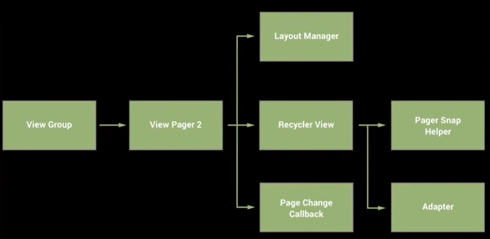

# ViewPager
O ViewPager é um importante componente visual do Android, permite gerenciar, por exemplo, a apresentação de inúmeros fragmentos vinculados às tabs.

<https://developer.android.com/training/animation/screen-slide>

## - Estrutura do ViewPager

A imagem abaixo mostra a estrutura do ViewPager:

 

## - Exemplo utilizando ViewPager

 

 

 